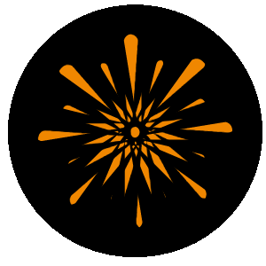

Navigator is a simple, modular, open-source autonomous driving stack. It's developed by Nova, an undergraduate research team at UT Dallas.

For docs, visit [our documentation site](https://nova-utd.github.io/navigator).

For info about our group, Nova, visit our [group site](https://nova-utd.github.io).
