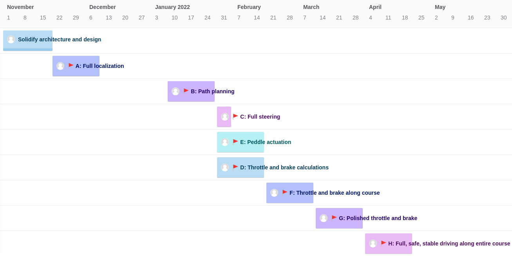

Demo 2 is Nova's Grand Tour. 

This overview is split into our **success conditions**, **tasks**, **timeline** and **checkpoints**:
- [Success conditions](/d2-overview#success-conditions) outline exactly what our software needs to do to finish the Grand Tour.
- [Broad tasks](/d2-overview#tasks) are the challenges we need to complete in order to succeed.
- [Checkpoints](/d2-overview#checkpoints) are clear milestones along our journey.
- The [timeline](/d2-overview#timeline) shows when we plan to reach each checkpoint.

# Success conditions
- [ ] The trip should be conducted on a light roadway, not within a parking lot or closed course.
- [ ] The car should remain within its lane throughout the trip.
- [ ] The car should maintain a reasonable speed and acceleration throughout the trip.
- [ ] The car should make a complete stop at stop signs, then continues after accounting for other vehicles/pedestrians at the intersection.
  - The location of stop signs, along with yield signs, crosswalks, and other static elements, can be provided ahead of time as map annotations. Our system does not need to detect signage in real time, but it does need to detect and track moving obstacles.
- [ ] The car should yield appropriately when entering a roundabout (the roundabout near JSOM and the Visitor Center).
- [ ] The car should stop or adjust speed for obstacles in front of it.
- [ ] The car should reduce speed when a pedestrian is significantly near, even if not in front.
- [ ] Speed, steering, and other key data should be displayed to the human driver throughout the trip.

# General tasks
The Grand Tour's tasks have four main components: A new behavior planner, safety improvements, a bigger map, and a new visualization tool.
- Revise or rewrite behavior (path) planner
    - Should produce appropriate speeds along the path
    - Should stop at stop signs, navigate simple intersections
    - Stop or slow down for nearby obstacles
        - Will require an object detector/classifier for pedestrians and vehicles, likely camera and ML-based
    - Likely draw from a Moving Object Tracker to predict future location of obstacles
    - Output commands through the steering controller to the Linear Actuators
- Improve platform safety
    - Create "heartbeat" signals for all nodes, including for E-stop
    - Write Health Monitor to manage and act on heartbeats
    - Raise flags on specific errors, like a loss in localization confidence or high CPU usage
- Extend operating area
    - Create a map of campus, with PCD split into chunks as needed
    - Map should include locations of stop signs, yield signs, and crosswalks (high-traffic pedestrian areas)
    - Write a tool to stitch together our PCD maps into a single clean file
- Visualize key observations and decisions
    - Target and current speed/acceleration
    - Target and current steering angle/effort
    - Position of car, signs, and dynamic obstacles on Lanelet map
    - Localization result confidence

We will focus only on the above goals. Everything else is beyond the scope of Demo 2.

<small>Possible layout of Demo 2 map area ("Grand Tour"), with loop split into eight colored sections. Car will move clockwise along the red route.</small>

<small>Target architecture of Demo 2.</small>

# Checkpoints
These are major steps along our path to the completion of Demo 2. Checkpoints are *not necessarily ordered*, so any checkpoint can be completed before another one. The checkpoints are:

**A:** <abbr title="Nova's software tool. The code that makes our car drive.">Navigator</abbr> can localize itself along the entire course

**B:** Navigator can generate a correct, sensible path along the entire course (accounting for position, not speed, so only steering is accounted for)

**C:** Navigator can steer itself along the entire course (essentially Demo 1 on a new course)

**D:**  Navigator can generate sensible throttle and brake commands, which are then followed by a human driver

**E:** Throttle and brake linear actuators can receive manual commands, so that the peddles can be teleoperated via a keyboard

**F:** Navigator can control the throttle and brake autonomously, though not correctly
- *Should drive autonomously through at least 80% of the course, by distance.*

**G:** Navigator can control the throttle and brake along the entire course

**H:** <abbr title="Our vehicle's name. It's like the comet Hale-Bopp, but for taxis.">Hail Bopp</abbr> can drive through 100% of the course, safely and smoothly, 3 times consecutively

# Timeline
## Table

| Sprint  | Dates         | Completed checkpoints        |
| --------|---------------|----------------------        |
| 1       | 10/29-11/18   | *Laying foundation*          |
| 2       | 11/19-12/9    | **A**                        |
| 3       | 12/10-12/30   | A                            |
| 4       | 1/7-1/27      | A, **B**                     |
| 5w1     | 1/28-2/3      | A, B, **C**                  |
| 5       | 1/28-2/17     | A, B, C, **D, E**            |
| 6       | 2/18-3/10     | A, B, C, D, E, **F**         |
| 7       | 3/11-3/31     | A, B, C, D, E, F, **G**      |
| 8       | 4/1-4/21      | A, B, C, D, E, F, G, **H**   |
| 9       | 4/22-4/29     | *Testing week*               |

## Graph

<small>Project roadmap generated by [ZenHub](https://zenhub.com), updated Oct. 30, '21. Click to enlarge.</small>

---

### Change log
10/30: Add Checkpoint H, link to timeline. WSH.

[timeline page]: <Demo-2-Timeline>