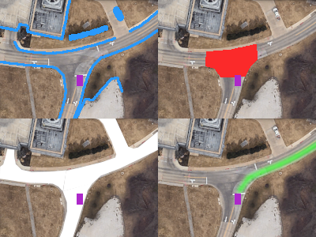

# Junction Manager
*Maintained by Ayush Sharma*

## Overview
This node controls the behavior of the car in a junction (Intersection). Given a junction grid (where each cell is either within an intersection or not), plus the current ego speed and occupancy grid, this node publishes a map that either includes the junction cost or not. This basically switches a junction's cost on or off, hence allowing or blocking entrance into junctions based on perception data.

## Subscribers and Publishers

### Subscribers
*   '/grid/occupancy/current' ([OccupancyGrid](https://docs.ros2.org/foxy/api/nav_msgs/msg/OccupancyGrid.html)): Shows the current grid that is being occupied by the car
*   '/grid/junction' ([OccupancyGrid](https://docs.ros2.org/foxy/api/nav_msgs/msg/OccupancyGrid.html)): Shows the grid of the junction
*   '/carla/hero/speedometer' (CarlaSpeedometer): Keeps track of current speed of the car

### Publishers
*   '/grid/stateful_junction' ([OccupancyGrid](https://docs.ros2.org/foxy/api/nav_msgs/msg/OccupancyGrid.html)): Defines the current junction cost
*   '/node_statuses' ([DiagnosticStatus](https://docs.ros2.org/galactic/api/diagnostic_msgs/msg/DiagnosticStatus.html)): Sends out the diagnostic status of the car

Top right image shows the junction cost generated due to a stop sign.