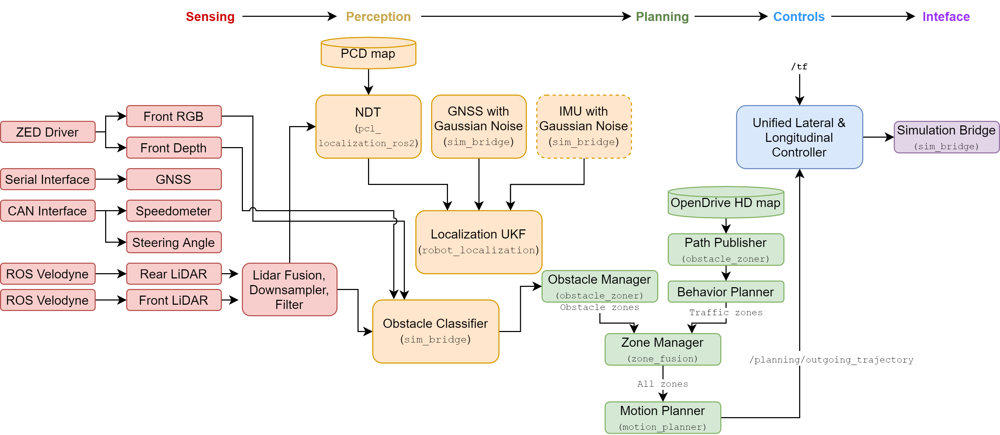

# System overview
{: .no_toc }

## Table of contents
{: .no_toc .text-delta }

1. TOC
{:toc}

---
## Navigator in CARLA

## Navigator in the real world

## Subsystems
Navigator features five subsystems:
- Sensing
- Perception
- Planning
- Control
- Interface

Each subsystem has its own page.

We also use simulation heavily for our testing and validation. See [our simulation overview](https://nova-utd.github.io/navigator/simulation/simulation-overview.html).