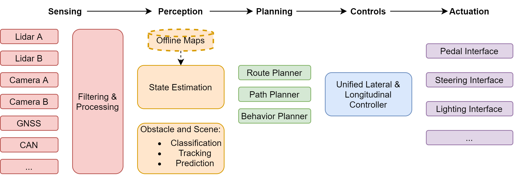

# System overview
{: .no_toc }

## Table of contents
{: .no_toc .text-delta }

1. TOC
{:toc}

---



## Section A
This is some text.

## Section B
This is some text.

### Here's an example from our code
```cpp
void MotionPlannerNode::send_message() {
    if (ideal_path == nullptr || odometry == nullptr) {
        // RCLCPP_WARN(this->get_logger(), "motion planner has no input path, skipping...");
        return;
    }
    Trajectory tmp = build_trajectory(ideal_path, horizon);
    if(zones != nullptr){
      limit_to_zones(tmp, *zones);
    }
    limit_to_curvature(tmp, max_lat_accel);
    smooth(tmp, max_accel, max_decel);
    trajectory_publisher->publish(tmp);
    return;
}
```

## Section C
This is some text.
