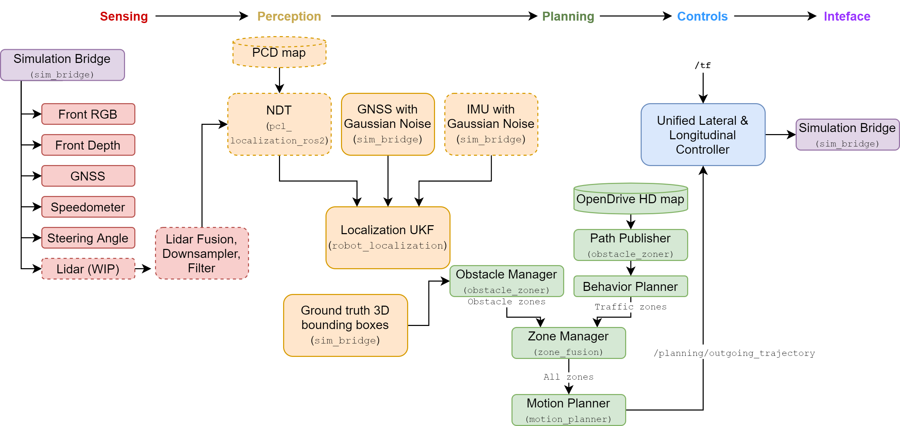

# System overview
{: .no_toc }

*Maintained by Will Heitman*

## Table of contents
{: .no_toc .text-delta }

1. TOC
{:toc}

---

## Design
Navigator is designed to be:

- **Simple**, with components that are easy to use an extend
    - When a more powerful but complex algorithm is used, a simpler alternative should also be present
- **Modular**, with nodes that can be swapped, added, and updated with the help of ROS2
    - Since nodes are all built using standard C++ and Python libraries, code is future-proofed.
- **Open source**, with all of our code licensed under the highly permissable MIT license
    - Our dependencies are also open-source

## Subsystems

Navigator is split into five main subsystems:
- [**Sensing**](/navigator/sensing/sensing-overview), where raw sensor data from cameras, GNSS, and more is filtered before being passed along
- [**Perception**](/navigator/planning/planning-overview), which uses the filtered sensor data to build a rich understanding of the car's surroundings
- [**Planning**](/navigator/planning/planning-overview), which uses this rich understanding, plus the desired destination, to decide how the car should act on a high level
- [**Controls**](/navigator/controls/controls-overview), where the desired action is compared to the car's current state and low-level action is calculated
- [**Interface**](/navigator/interface/interface-overview), where the low-level action is sent to the steering wheel and pedals.

We also have some important code to support testing, visualization, and simulation. Simulation plays a big role in our development, and you can find an overview of it [here](/navigator/simulation/simulation-overview).

#### Example
Our **sensing** system takes in a red blob from our front camera and does some white balancing to make the image more clear. The **perception** system identifies this red blob as a stop sign and generates a bounding box with the coordinates of the stop sign relative to the car. The **planning** system determines that we must set our speed to zero at the stop sign. The **controls** system notes that our car is still moving, and calculates that we must decelerate a certain amount. Finally, our **actuation** system converts this desired deceleration into a brake pedal command, which is sent out to the pedal's motor.