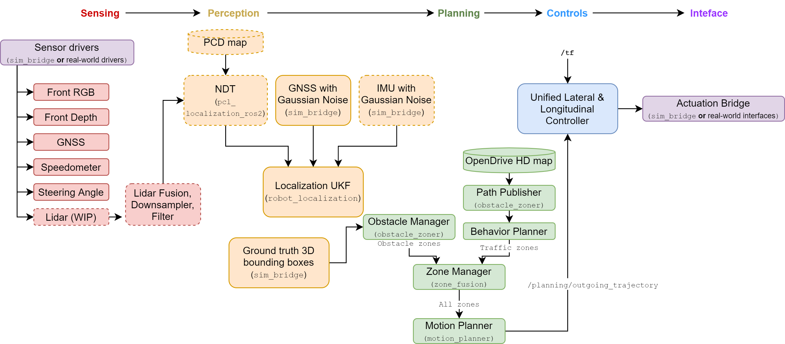
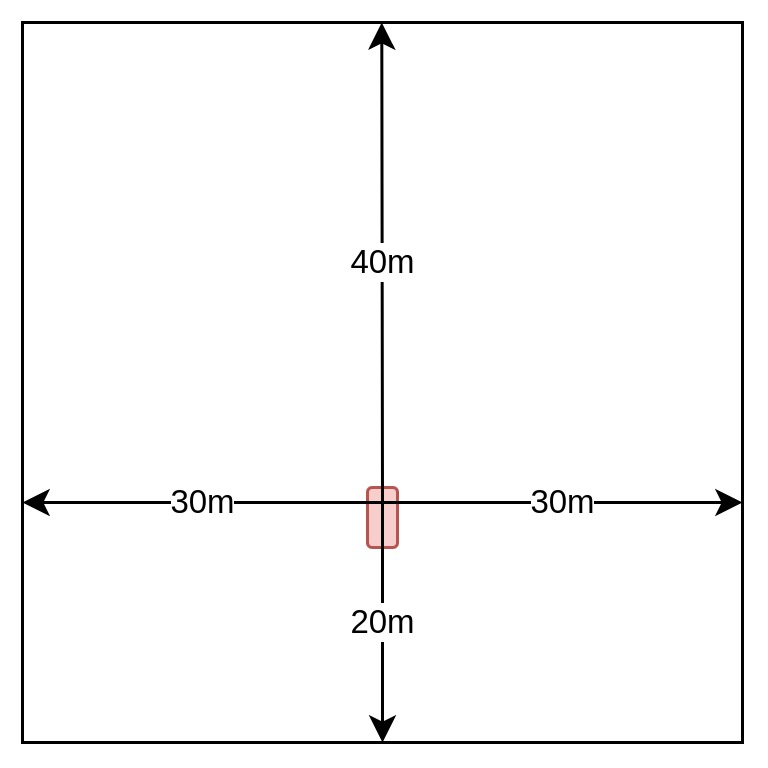

# System overview
{: .no_toc }

*Maintained by Will Heitman*

## Table of contents
{: .no_toc .text-delta }

1. TOC
{:toc}

---

## Design
Navigator is designed to be:

- **Simple**, with components that are easy to use an extend
    - When a more powerful but complex algorithm is used, a simpler alternative should also be present
- **Modular**, with nodes that can be swapped, added, and updated with the help of ROS2
    - Since nodes are all built using standard C++ and Python libraries, code is future-proofed.
- **Open source**, with all of our code licensed under the highly permissable MIT license
    - Our dependencies are also open-source

### About nodes and topics
Navigator is built upon ROS2, a communications framework where individual executables called "nodes" exchange messages throguh "topics." A node can either subscribe to a topic or publish to it. In this fashion, individual nodes form a dense network where everything from camera streams to steering commands are passed from one node to the next.

Nodes can be grouped into packages. Packages are then grouped in workspaces. Navigator itself is a ROS workspace. It contains many packages, and each package contains at least one node.

{: .example}
Using ROS2, one node can gather raw LiDAR data from a sensor, where it publishes the pointcloud as a `PointCloud2` message to a topic called `/lidar/raw`. Another node can then subscribe to `/lidar/raw`, filter the data, and publish the result to `/lidar/filtered`.

To learn more about ROS, watch [this lecture by Katherine Scott](https://www.youtube.com/watch?v=FTA4Ia2vLS8), a developer advocate at Open Robotics.
<!-- ## Subsystems

Navigator is split into five main subsystems:
- [**Sensing**](/navigator/sensing/sensing-overview), where raw sensor data from cameras, GNSS, and more is filtered before being passed along
- [**Perception**](/navigator/planning/planning-overview), which uses the filtered sensor data to build a rich understanding of the car's surroundings
- [**Planning**](/navigator/planning/planning-overview), which uses this rich understanding, plus the desired destination, to decide how the car should act on a high level
- [**Controls**](/navigator/controls/controls-overview), where the desired action is compared to the car's current state and low-level action is calculated
- [**Interface**](/navigator/interface/interface-overview), where the low-level action is sent to the steering wheel and pedals. -->

<!-- We also have some important code to support testing, visualization, and simulation. Simulation plays a big role in our development, and you can find an overview of it [here](/navigator/simulation/simulation-overview). -->

<!-- #### Example
Our **sensing** system takes in a red blob from our front camera and does some white balancing to make the image more clear. The **perception** system identifies this red blob as a stop sign and generates a bounding box with the coordinates of the stop sign relative to the car. The **planning** system determines that we must set our speed to zero at the stop sign. The **controls** system notes that our car is still moving, and calculates that we must decelerate a certain amount. Finally, our **actuation** system converts this desired deceleration into a brake pedal command, which is sent out to the pedal's motor. -->

## Subsystems
We can divide Navigator's nodes into four groups.

The **sensing** subsystem takes raw sensor data and publishes them as [`Image`](https://docs.ros.org/en/indigo/api/sensor_msgs/html/msg/Image.html) messages, [`PointCloud2`](https://docs.ros.org/en/indigo/api/sensor_msgs/html/msg/PointCloud2.html) messages, [`Imu`](https://docs.ros.org/en/indigo/api/sensor_msgs/html/msg/Imu.html) messages, and so on. This subsystem also include sensor filters, which subscribe to raw data and publish their filtered results.

The **perception** subsystem draws inferences from the sensor data, including the location of pedestrians, our position on the map, and the predicted motion of surrounding vehicles. Nodes in this subsystem often publish their results as [**cost maps**](#cost-maps).

The **planning** subsystem takes our perception results and decides what our vehicle should do. This subsystem handles both high-level decisions (Should we pass a car that's stopped in the road?) and low-level ones (How far should we press the throttle pedal to reach our desired speed?).

The **interface** subsystem is the link between our software and hardware. It includes nodes that communicate with our steering hardware, our microcontroller, and more. Both the sensing and interface subsystems are **vehicle-specific**, which means that they need to be configured to suite each individual vehicle. At Nova, we have separate configurations for simulated driving and real-world use.

## Cost maps
During execution, Navigator calculates several cost maps, which are grid-based maps of our surrounding area that describe where our car should or should not drive.

Each cell in the grid is assigned a cost. The higher the cost, the less likely our car will generate a path that moves through the cell. This results in paths that weave their way through only low-cost cells. If no low-cost cells are available, the car stops and waits.

We calculate and use multiple cost maps, each one representing a unique factor to consider. For example:
- Our occupancy grid generator describes the location of objects (cars, people, curbs). 
- Our prediction network (PredNet) node describes the *future* location of obstacles.
- Our red light detector marks intersections as high-cost regions if the light is red.
- Our map manager assigns costs based on how far a cell is from the route and from the goal.

We add as many of these layers together to form a single, holisitic costmap that our motion planner uses as its input.

<small>Above: Cost map dimensions</small>

Cost maps should be in the `base_link` (vehicle) reference frame. They should extend 40 meters in front and to the side of the car and 20 meters behind, forming a total area of 80 x 60 meters. Cells should have a side length of either 0.2, 0.4, 0.8, or 1.6 meters.

In the above example, each image is 200 x 150 pixels, representing a cost map layer with a resolution of 0.4 meters/cell. Clockwise from top left: Current occupancy, junction cost (due to a stop sign), route distance, and drivable area.

## Topics
- `/lidar/fused`: Raw LiDAR fused together to create a 360-degree picture. Otherwise unfiltered.
- `/lidar/filtered`: Filtered LiDAR, with ground points removed.
- `/grid/drivable`
- `/grid/route_distance`
- `/grid/occupancy/current`: Only the current occupancy grid.
- `/grid/occupancy/combined`: Both the current and all future prediction occupancy grids, summed together. 